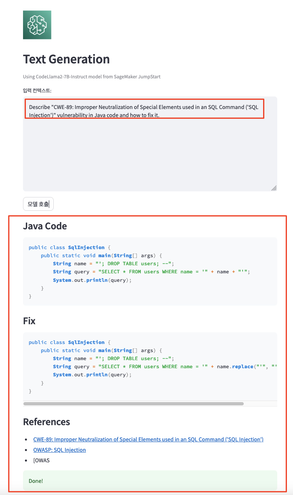
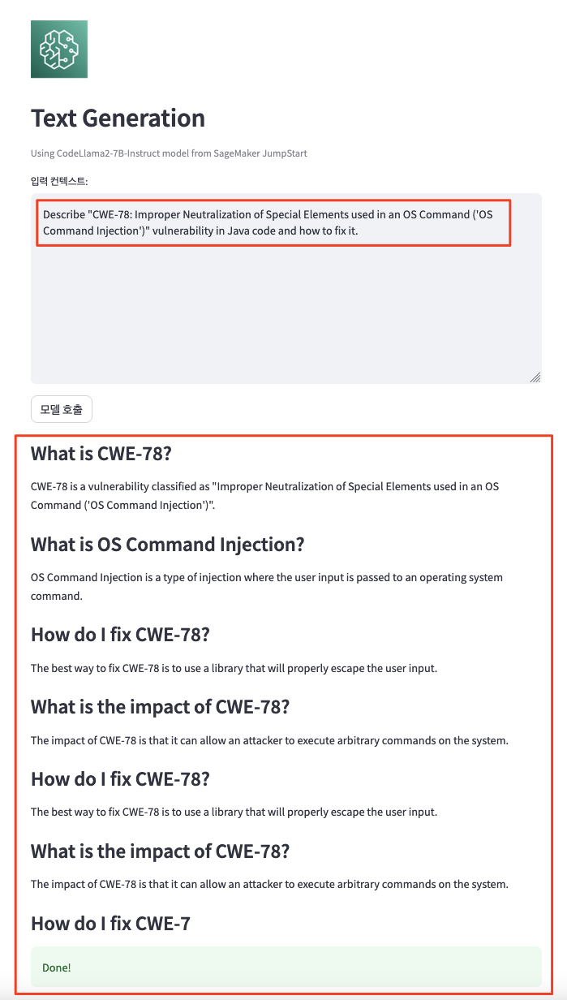
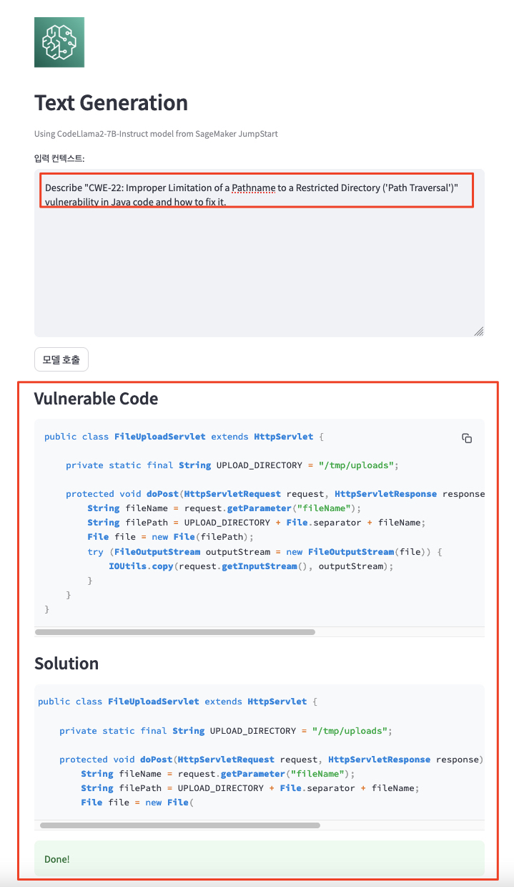
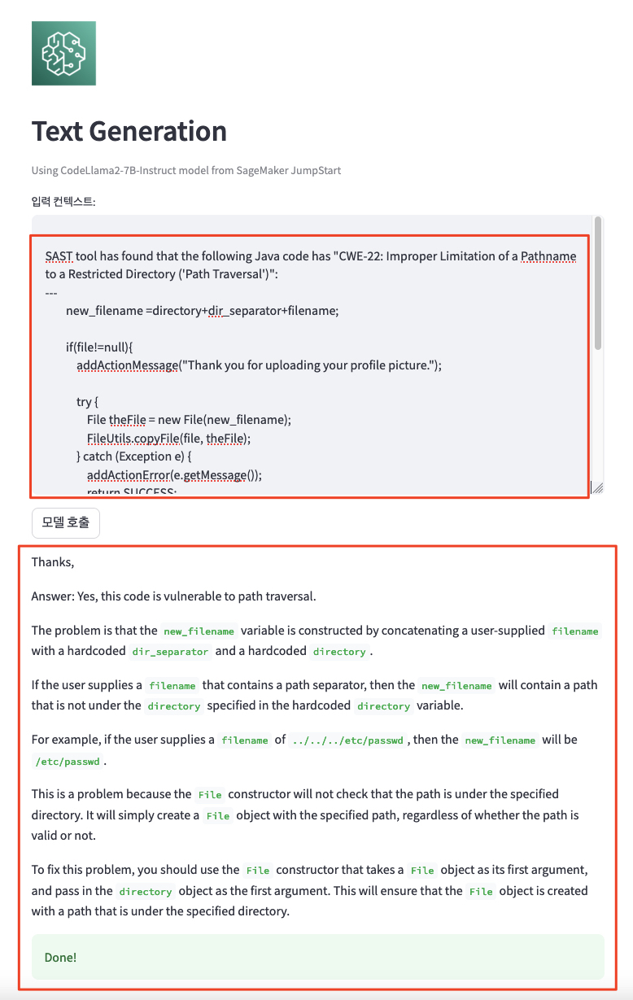

# 0. 총평
AppSec 활동에 CodeLlama와 같은 생성형 AI를 높은 수준으로 접목시키기는 아직 어렵다고 판단되며, 진단은 SAST 툴에서 할테니 부가적인 조치 방법만을 다시 한번 확인해 달라는 용도로 사용해 보면 어떨까 합니다.<br>
이 때 프롬프트는 몇 단계의 수준별로 구성하는 것이 좋아보입니다.<br>

첫 번째는 구체적이고 간결한 기술적인 사항만을 입력하는 것이 좋아 보입니다. 예를 들어 아래와 같은 형식입니다.<br>
> 구체적이고 간결한 프롬프트<br>
> **<u>Describe "CWE-89: Improper Neutralization of Special Elements used in an SQL Command ('SQL Injection')" vulnerability in Java code and how to fix it.</u>**

두 번째는 취약점이 발견된 코드를 포함하여 프롬프트를 구성하는 것입니다.<br>
> 취약점 코드를 포함하여 프롬프트를 구성<br>
* Command Injection
```
SAST tool has found that the following code has command injection vulnerability:
    public String sendMail(String[] cmd)
    {
        Runtime rt = Runtime.getRuntime();
        //call "legacy" mail program
        Process proc = null;
        StringBuilder message = new StringBuilder();
        try
        {
            if(cmd!=null){
                System.out.println(cmd[0]);
                System.out.println(cmd[1]);
                System.out.println(cmd[2]);
            }
            else{
                System.out.println("cmd is empty!");
            }

            proc = rt.exec(cmd);

            InputStream is = proc.getInputStream();
            int read;
            while( (read = is.read()) > 0)
            {
                message.append((char)read);
            }
        }
        catch(Exception e)
        {
            e.printStackTrace();
            System.out.println(e.getMessage());
            System.out.println(e.getLocalizedMessage());
        }
        finally
        {
            if (proc != null)
                proc.destroy();
        }

        //update local mail too
        updateMail();
        return message.toString();
    }

Do you think this code really is vulnerable and if so, please tell me how to fix it.
```

* SQL Injection
```
SAST tool has found that the following Java code has "CWE-89: Improper Neutralization of Special Elements used in an SQL Command ('SQL Injection')" vulnerability:
---
        Connection conn=null;
        Statement statement = null;
        ArrayList locations = new ArrayList();

        try{
            conn = ConnFactory.getInstance().getConnection();

            String queryStr = "SELECT * FROM location WHERE branch = 'Yes' AND state = '" + state + "' AND city = '" + city + "' AND address = '" + address + "'";
            statement = conn.createStatement();
            ResultSet rs = statement.executeQuery(queryStr);
            while (rs.next())
            {
                locations.add(new Location(rs.getString("address"), rs.getString("city"), rs.getString("state"), rs.getString("zip"), rs.getString("atm"), rs.getString("branch")));
            }
        }
        finally{
            safeCloseStatement(statement);
            safeCloseConnection(conn);
        }

---
Tell me how to fix it.
```

* Path Traversal
```
SAST tool has found that the following Java code has "CWE-22: Improper Limitation of a Pathname to a Restricted Directory ('Path Traversal')" vulnerability:
---
        new_filename =directory+dir_separator+filename;

        if(file!=null){
            addActionMessage("Thank you for uploading your profile picture.");

            try {
                File theFile = new File(new_filename);
                FileUtils.copyFile(file, theFile);
            } catch (Exception e) {
                addActionError(e.getMessage());
                return SUCCESS;
            }

            return SUCCESS;
        }
        else{
            addActionError("Failed to upload the Profile Picture");
            return SUCCESS;
        }
---
Tell me how to fix it.
```

만약 응답값이 비어있다면, 모델이 해당 사항에 대해 알지 못한다는 것일 가능성이 큽니다.<br>
또한 Hallucination 응답은 많이 억제된 것으로 보입니다.

# 1. CodeLlama-7B 기본 모델 및 Instruct 모델 검증


## 1.1. Prompt 테스팅
1. Prompt 1 - SQL Injection<br>
* 프롬프트
```text
Describe "CWE-89: Improper Neutralization of Special Elements used in an SQL Command ('SQL Injection')" vulnerability in Java code and how to fix it.
```

* 응답 - CodeLlama-7B<br>


2. Prompt 2 - Command Injection<br>
* 프롬프트
```text
Describe "CWE-78: Improper Neutralization of Special Elements used in an OS Command ('OS Command Injection')" vulnerability in Java code and how to fix it.
```

# 응답<br>


3. Prompt 3 - Potential Path Traversal (file read)
* 프롬프트
```text
Describe "CWE-22: Improper Limitation of a Pathname to a Restricted Directory ('Path Traversal')" vulnerability in Java code and how to fix it.
```

* 응답 - CodeLlama-7B<br>


* 응답 - CodeLlama-7B-Instruct<br>
  


4. Prompt 4 - 코드를 포함한 Potential Path Traversal (file read)
* 프롬프트
```text
SAST tool has found that the following Java code has "CWE-22: Improper Limitation of a Pathname to a Restricted Directory ('Path Traversal')":
---
        new_filename =directory+dir_separator+filename;

        if(file!=null){
            addActionMessage("Thank you for uploading your profile picture.");

            try {
                File theFile = new File(new_filename);
                FileUtils.copyFile(file, theFile);
            } catch (Exception e) {
                addActionError(e.getMessage());
                return SUCCESS;
            }

            return SUCCESS;
        }
        else{
            addActionError("Failed to upload the Profile Picture");
            return SUCCESS;
        }
---
Do you think this code really is vulnerable and if so, please tell me how to fix it.
```

* 응답 - CodeLlama-7B<br>
TODO

* 응답 - CodeLlama-7B-Instruct<br>


