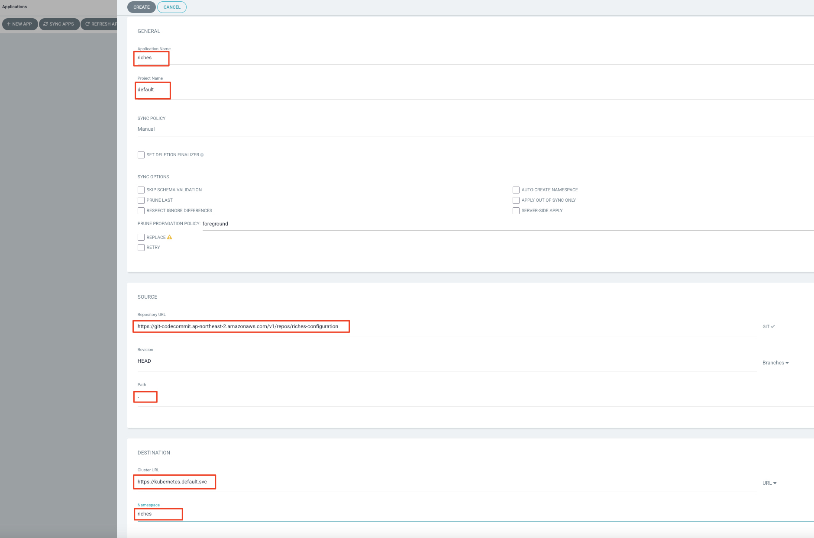
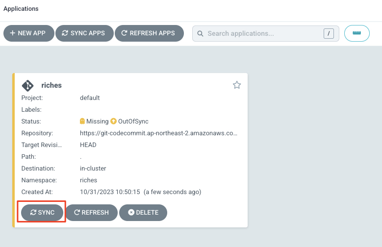
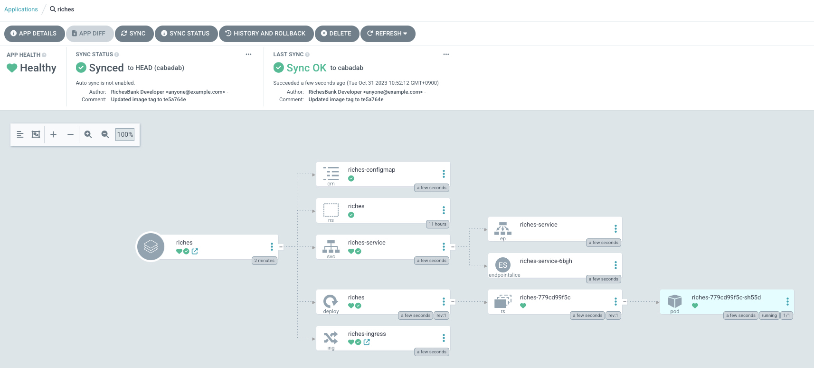
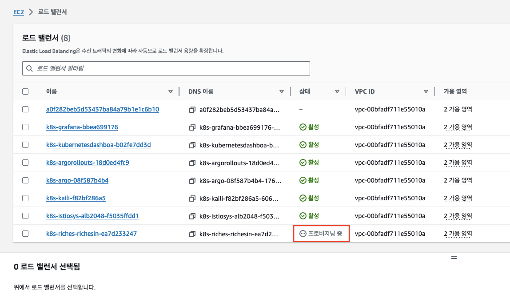
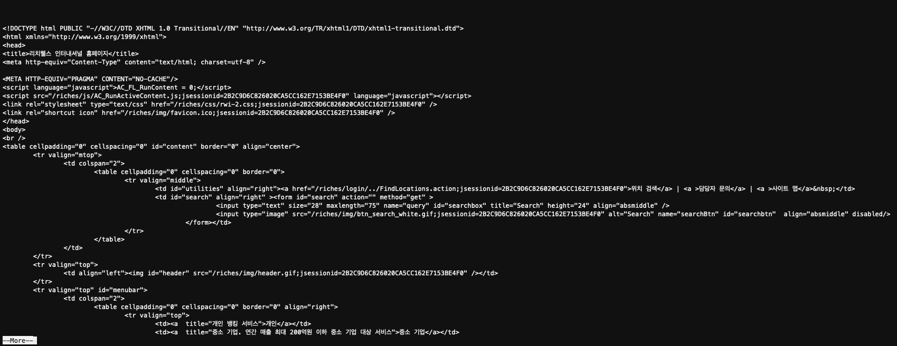
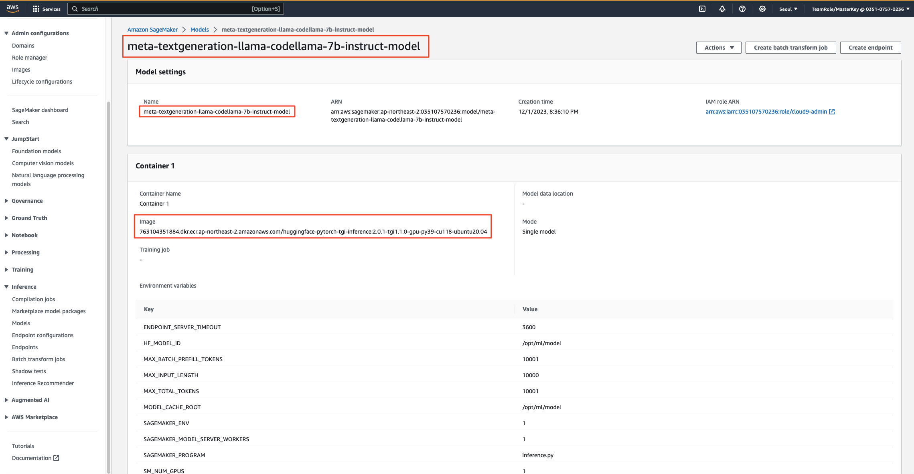
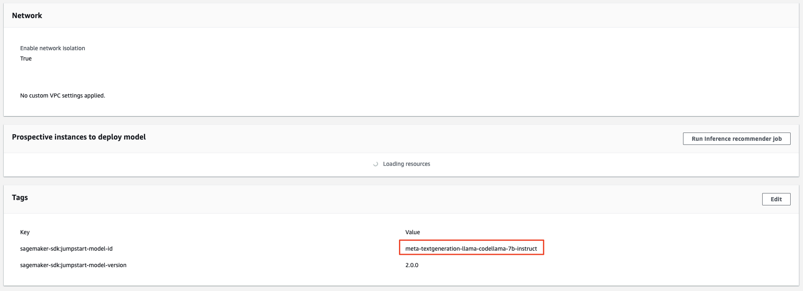

# AppSec Demo Workshop

## Agenda
1. Cloud9 통합 환경 (IDE) 생성 (CloudShell)
2. Cloud9 통합 환경 (IDE) 설정 (Cloud9)
3. AppSec Demo Kit 받기
4. EKS 클러스터 생성 (테라폼 사용)
5. 취약 어플리케이션 배포
   1. Helm 리포지터리 설정
   2. 어플리케이션 빌드 및 ECR 푸시
   3. ArgoCD를 통한 배포
6. 취약점 수동 점검
7. 발견한 취약점에 대해 필요한 조치 사항을 Generative AI를 통해 확인
8. 생성형 AI를 통한 AppSec 활동 가속화 (Amazon Bedrock, WIP)

## 1. Cloud9 통합 환경 (IDE) 생성

### 1.1. AWS Cloud9 환경 생성 (AWS CLI 사용)
진행자가 제공한 AWS 관리 콘솔에서 ```CloudShell```을 실행한 후 아래 명령을 수행하여 ```Cloud9``` 환경을 생성해 줍니다.<br>
```CloudShell```도 다수의 개발 언어와 런타임, 그리고 클라우드 환경을 다룰 수 있는 CLI를 기본적으로 제공하지만 보다 풍부한 통합 개발 환경을 제공하는 ```Cloud9```을 사용하기로 합니다.<br>
아래 명령은 ```Cloud9``` 환경을 구성하기 위하여 일련의 작업을 수행하므로 완료될 때까 다소 시간이 걸립니다 (1 ~ 2분)
```bash
curl -fsSL https://raw.githubusercontent.com/shkim4u/m2m-travelbuddy/main/cloud9/bootstrap-v2-with-admin-user-trust.sh | bash -s -- c5.9xlarge
```

## 2. Cloud9 통합 환경 (IDE) 설정
```Cloud9``` 통합 환경에 접속하여 필요한 사항을 사전에 구성한 쉘 스크립트 파일을 아래와 같이 실행합니다.

여기에는 다음 사항이 포함됩니다.

1. IDE IAM 설정 확인
2. 쿠버네테스 (Amazon EKS) 작업을 위한 Tooling
    * kubectl 설치
    * eksctl 설치
    * k9s 설치
    * Helm 설치
3. AWS CLI 업데이트
4. AWS CDK 업그레이드
5. 기타 도구 설치 및 구성
    * AWS SSM 세션 매니저 플러그인 설치
    * AWS Cloud9 CLI 설치
    * jq 설치하기
    * yq 설치하기
    * bash-completion 설치하기
6. Cloud9 추가 설정하기
7. 디스크 증설
8. CUDA Deep Neural Network (cuDNN) 라이브러리

```bash
cd ~/environment/
curl -fsSL https://raw.githubusercontent.com/shkim4u/m2m-travelbuddy/main/cloud9/cloud9.sh | bash
```

## 3. AppSec Demo Kit 받기
의도적으로 취약점이 주입된 레거시 모놀리스 어플리케이션 소스 코드를 다운로드 받습니다.<br>
```bash
cd ~/environment/
git clone https://github.com/shkim4u/m2m-travelbuddy.git appsec
cd appsec
```

해당 소스 코드에는 테라폼으로 작성된 IaC 코드도 포함되어 있으며 여기에는 ```Amazon EKS```, ```Amazon RDS```, ```Amazon MSK``` 등의 자원이 포함되어 있습니다.<br>
우선 이 테라폼 코드를 사용하여 자원을 배포하도록 합니다.

## 4. EKS 클러스터 생성 (테라폼 사용)
본격적으로 자원을 생성하기 앞서, 우선 아래 명령을 실행하여 몇몇 ALB (취약 어플리케이션, ArgoCD, Argo Rollouts 등)에서 사용하기 위한 Amazon Certificate Manager (ACM) 사설 (Private) CA를 생성하고 Self-signed Root CA 인증서를 설치합니다.<br>

```bash
hash -d aws

cd ~/environment/appsec/infrastructure-terraform

# 1. Configure Terraform workspace and Private Certificate Authority.
. ./configure.sh appsec ap-northeast-2

echo $TF_VAR_ca_arn
```

위와 같이 수행하면 ACM에 사설 CA가 생성되는데 진행자와 함께 ACM 콘솔로 이동하여 Private CA를 한번 살펴봅니다.<br>
아래와 같이 Private CA가 활성 상태인 것을 확인합니다.<br>


> (주의)<br>
> [2023-12-25] 현재 아래 사항을 환경 변수에 추가로 설정해야 합니다. 해당 내용에 대해서는 `sanghyou@amazon.com`에 문의하세요.
> * EKS 클러스 이름
> * 개발자 슬랙 채널 이름과 웹훅 URL
> * 보안 담당자 슬랙 채널과 휍훅 URL


이제 아래 명령어를 통해 ```Amazon EKS ``` 클러스터 및 기타 자원을 생성합니다. 15 ~ 20분 정도 소요됩니다.<br>
```bash
# 1. IaC 디렉토리로 이동
cd ~/environment/appsec/infrastructure-terraform

# terraform init
terraform init

# terraform plan
terraform plan

# terraform apply
terraform apply -var='exclude_msk=true' -auto-approve
```

모든 자원의 생성이 완료되면 아래와 같이 ArgoCD Admin 암호를 설정합니다.<br>
```bash
# 아래 명령을 수행하면 ArgoCD 서버의 Admin 암호를 설정하고 이를 AWS Secrets Manager에 동기화 저장합니다.
# AWS Secrets Manager에 동기화 저장된 암호는 어플리케이션의 배포 파이프라인에서 배포 단계에 사용됩니다.
cd ~/environment/appsec/cloud9
./set-argocd-admin-password.sh <선호하는 ArgoCD Admin 암호> <AWS Secrets Manager Secrets ID: (예) riches-ci-argocd-admin-password>
```

## 5. 취약 어플리케이션 배포
의도적으로 취약점이 주입된 뱅킹 어플리케이션을 (리치웰스 인터내셔널 뱅킹) EKS 클러스터에 배포합니다.

> (주의)<br>
> <u>***해당 어플리케이션은 교육이나 데모 용도로만 사용하여야 하며 실제 고객 환경이나 운영 환경에는 배포되지 말아야 합니다.***</u>

### 5.1. Helm 리포지터리 설정
아래와 같이 Cloud9 환경에서 Helm Artifact를 배포 리포지터리와 연결합니다.<br>

```bash
# 0. Git 초기화
cd ~/environment/appsec
rm -rf .git

# 1. 어플리케이션 Helm Artifact 경로로 이동
cd ~/environment/appsec/applications/RichesBank/helm

# 2. git 연결
git init
git branch -M main

export HELM_CODECOMMIT_URL=$(aws codecommit get-repository --repository-name riches-configuration --region ap-northeast-2 | grep -o '"cloneUrlHttp": "[^"]*' | grep -o '[^"]*$')
echo $HELM_CODECOMMIT_URL

# CodeCommit 배포 리포지터리와 연결
git remote add origin $HELM_CODECOMMIT_URL

# 3. Git 스테이징 영역에 파일을 추가합니다.
git add .

# 4. Commit 및 배포 리포지터리에 Push합니다.
git commit -am "First commit."
git push --set-upstream origin main
```

(참고) 기존의 Git Upstream Repository 정보를 유지하면서 CodeCommit Repository를 Remote Repository로 추가하려면 다름과 같이 수행합니다. (예: 로컬 랩탑 작업 환경에서 작업하는 경우 등)<br>
```bash
# 1. 어플리케이션 Helm Artifact 경로로 이동
# (참고) 소스를 다운로드 받을 위치에 따라 아래의 경로를 적절하게 수정합니다.  
cd ~/environment/appsec/applications/WebGoat/helm

# 2. git 연결
# 우리는 Git 리포지터리를 초기화하지 않았으므로, 아래와 같이 하면 Outer git 저장소 내에 Inner git 저장소를 Tracking하게 됩니다. 이와 유사하지만 Git 저장소 내에서 Nested Git 저장소를 좀 더 체계적으로 운영하는 방법은 Git Submodule이 있습니다.
git init
git branch -M main

export HELM_CODECOMMIT_URL=$(aws codecommit get-repository --repository-name webgoat-configuration --region ap-northeast-2 | grep -o '"cloneUrlHttp": "[^"]*' | grep -o '[^"]*$')
echo $HELM_CODECOMMIT_URL

# CodeCommit 배포 리포지터리와 연결
git remote add ccorigin $HELM_CODECOMMIT_URL

# 3. Git 스테이징 영역에 파일을 추가합니다.
git add .

# 4. Commit 및 배포 리포지터리에 Push합니다.
git commit -am "First commit."
git push --set-upstream ccorigin main
```

### 5.2. 어플리케이션 빌드 및 ECR 푸시
1. 이제 어플리케이션의 빌드 파이프라인이 시작될 수 있도록 어플리케이션 소스를 소스 리포지터리에 연결하고 푸시합니다.<br>

```bash
# 0. Git 초기화는 위에서 수행하였으므로 다시 수행하지 않아도 됩니다.

# 1. 어플리케이션 소스 경로로 이동
cd ~/environment/appsec/applications/WebGoat/build

# 2. git 연결
git init
git branch -M main

# AWS CLI를 통해서도 HTTPS URL을 바로 확인할 수 있습니다.
export APP_CODECOMMIT_URL=$(aws codecommit get-repository --repository-name webgoat-application --region ap-northeast-2 | grep -o '"cloneUrlHttp": "[^"]*' | grep -o '[^"]*$')
echo $APP_CODECOMMIT_URL

# CodeCommit 소스 리포지터리와 연결
git remote add origin $APP_CODECOMMIT_URL

# 3. Git 스테이징 영역에 파일을 추가합니다.
git add .

# 4. Commit 및 소스 리포지터리에 Push합니다.
git commit -am "First commit."
git push --set-upstream origin main
```

(참고) 앞서 Helm 저장소 설정과 마찬가지로 기존의 Git Upstream Repository 정보를 유지하면서 CodeCommit Repository를 Remote Repository로 추가하려면 다름과 같이 수행합니다. (예: 로컬 랩탑 작업 환경에서 작업하는 경우 등)<br>
```bash
# 1. 어플리케이션 Helm Artifact 경로로 이동
# (참고) 소스를 다운로드 받을 위치에 따라 아래의 경로를 적절하게 수정합니다.  
cd ~/environment/appsec/applications/RichesBank/build

# 2. git 연결
# 우리는 Git 리포지터리를 초기화하지 않았으므로, 아래와 같이 하면 Outer git 저장소 내에 Inner git 저장소를 Tracking하게 됩니다. 이와 유사하지만 Git 저장소 내에서 Nested Git 저장소를 좀 더 체계적으로 운영하는 방법은 Git Submodule이 있습니다.
git init
git branch -M main

# AWS CLI를 통해서도 HTTPS URL을 바로 확인할 수 있습니다.
export APP_CODECOMMIT_URL=$(aws codecommit get-repository --repository-name riches-application --region ap-northeast-2 | grep -o '"cloneUrlHttp": "[^"]*' | grep -o '[^"]*$')
echo $APP_CODECOMMIT_URL

# CodeCommit 소스 리포지터리와 연결
git remote add ccorigin $APP_CODECOMMIT_URL

# 3. Git 스테이징 영역에 파일을 추가합니다.
git add .

# 4. Commit 및 배포 리포지터리에 Push합니다.
git commit -am "First commit."
git push --set-upstream ccorigin main
```

4. 빌드 파이프라인이 성공적으로 수행되는지 확인합니다.<br>


### 5.3. ArgoCD를 통한 배포
1. ArgoCD 접속에 필요한 정보 확인 및 접속<br>
테라폼을 통해서 이미 배포한 EKS 클러스터에는 ArgCD가 설치되어 있으며, 또한 AWS ELB (Elastic Load Balancer)를 통하여 외부에서 접속할 수 있습니다.<br>

아래와 같이 ArgoCD 접속에 필요한 URL과 ```admin``` 암호를 확인합니다.<br>

```bash
# ArgoCD 접속 주소 확인
export ARGOCD_SERVER=`kubectl get ingress/argocd-server -n argocd -o json | jq --raw-output '.status.loadBalancer.ingress[0].hostname'`
echo https://$ARGOCD_SERVER

# 아래는 위에서 ArgoCD Admin 사용자의 암호를 변경하였으므로 더 이상 유효하지 않습니다만, 기록을 위해 남겨둡니다.
# ArgoCD의 기본 사용자 (admin) 패스워드 확인
ARGO_PWD=`kubectl -n argocd get secret argocd-initial-admin-secret -o jsonpath="{.data.password}" | base64 -d`
echo $ARGO_PWD
```

확인한 접속 주소와 패스워드를 사용하여 ArgoCD Web UI에 접속해 봅니다.<br>


2. ArgoCD가 빌드 리포지터리에 접속할 수 있도록 IAM 사용자 및 Git Credentials을 생성합니다 (CLI 사용).<br>
```bash
# IAM User 생성
aws iam create-user --user-name argocd 

# AWSCodeCommitPowerUser 관리형 권한 정책 연결 (arn:aws:iam::aws:policy/AWSCodeCommitPowerUser)
aws iam attach-user-policy --user-name argocd --policy-arn arn:aws:iam::aws:policy/AWSCodeCommitPowerUser

# CodeCommit 접근을 위한 Specific Credential 생성
# (중요) 결과로서 반환되는 "ServiceUserName"과 "ServicePassword"를 기록해 둡니다.
aws iam create-service-specific-credential --user-name argocd --service-name codecommit.amazonaws.com
```

4. ArgoCD 설정<br>
- 로그인 이후 좌측의 Settings 를 클릭한 뒤 Repositories 항목을 클릭합니다.<br>
  

- Connect Repo 버튼을 클릭하고 Method는 ```VIA HTTPS```, Project는 ```default```를 입력합니다.<br>

- Repository URL에는 앞서 확인한 배포 CodeCommit Repository의 HTTPS 주소를, Username 및 Password에는 메모해 둔 정보를 입력합니다.<br>
   ```bash
   export HELM_CODECOMMIT_URL=$(aws codecommit get-repository --repository-name webgoat-configuration --region ap-northeast-2 | grep -o '"cloneUrlHttp": "[^"]*'|grep -o '[^"]*$')
   echo $HELM_CODECOMMIT_URL
   ```
<br>


- Application 텝에서 ```NewApp```버튼을 클릭합니다. Application Name 에는 ```webgoat```을, Project는 ```default```를 입력합니다. Sync Policy에는 "Manual"을, Repository URL에는 앞서 설정한 배포 리포지터리를, PATH에는 ```.```을 각각 입력합니다. Destination 섹션의 Cluster URL에는 ```https://kubernetes.default.svc```, Namespace에는 ```webgoat```을 입력하고 상단의 Create를 클릭합니다.<br>
- (참고) 아래 그림에서는 ```riches```라고 표기되어 있지만 ```webgoat```으로 입력합니다.<br>
  

> (참고)<br>
> Application 생성 시 화면 하단에 Helm Setting 값들이 정상적으로 표시되는지 확인합니다.

## 5. ArgoCD 배포 상태 확인<br>
1. ```Sync``` 버턴을 누르고 ArgoCD 화면에서 ```WebGoat``` 어플리케이션의 배포 상태를 확인합니다.<br>
   <br>
   <br>

> (참고)<br>
> Helm Chart를 통해 배포되면 Ingress를 통해 AWS Application Load Balancer가 Provisioning됩니다.<br>
> 

2. ```WebGoat``` 어플리케이션에 접속해 봅니다.<br>

```bash
export API_URL=https://$(kubectl get ingress/webgoat-ingress -n webgoat -o jsonpath='{.status.loadBalancer.ingress[*].hostname}')
echo ${API_URL}/WebGoat/

curl -fsSL --insecure ${API_URL}/WebGoat/

echo ${API_URL}/WebGoat/
```



## 6. 취약점 수동 점검
(보안 담당자로서) 진행자의 안내에 따라 존재하는 취약점을 수동으로 점검해 봅니다.<br>

> (참고)<br>
> 해당 어플리케이션에는 대표적인 3개의 취약점이 잠재되어 있습니다.<br>
> * SQLi (SQL Injection)
> * CI (Command Injection)
> * XSS (Cross-Site Scripting)<br>
> 
> 각각의 범주에서 하나 이상의 취약점 화면을 찾아 보세요.

## 7. 발견한 취약점에 대해 필요한 조치 사항을 Generative AI를 통해 확인
### 7.1. Generative AI 모델 (CodeLlama2-7B-Instruct) 배포
취약점에 대해 조언을 해줄 Generative AI 모델인 ```CodeLlama-7B-Instruct``` 모델을 배포합니다.<br>
SageMaker JumpStart를 사용하여 배포하는데, 현재 SageMaker JumpStart 모델은 CDK나 CloudFormation에서 공식적으로 지원되지 않으므로 우선 SageMaker Python SDK를 사용하여 배포합니다.

```bash
cd ~/environment/appsec/sagemaker-cdk

# Python 가상 환경 설정
python3 -m venv .venv
source .venv/bin/activate

# pip 업그레이드
python3 -m pip install --upgrade pip

# 의존성 설치
pip install -r requirements.txt

# CodeLlama2-7B-Instruct 모델 및 SageMaker 엔드포인트 배포
# CodeLlama-7B 기본 모델
#python3 scripts/deploy_sagemaker_model.py meta-textgeneration-llama-codellama-7b ml.g5.4xlarge
# CodeLlama-7B-Instruct 모델
python3 scripts/deploy_sagemaker_model.py meta-textgeneration-llama-codellama-7b-instruct ml.g5.4xlarge
```

위 단계가 성공적으로 수행되면 아래 그림과 같이 ```SageMaker Model```과 ```Endpoint```가 생성됩니다.

* CodeLlama2-7B-Instruct SagaMaker 모멜
  * 
  * 
* SageMaker 모델 엔드포인트
  * 

### 7.2. 프롬프트를 호스팅하는 웹 서버 배포
어플리케이션에 대한 취약점에 대한 내용을 프롬프트로 받아 이에 대한 확도 (Certainty)나 조치 방법을 묻의할 수 있는 웹 서버를 배포해 보도록 하겠습니다.<br>

```bash
cd ~/environment/appsec/sagemaker-cdk

# CDK bootstrap.
cdk bootstrap

# VPC Stack 배포.
cdk deploy GenerativeAiNetworkStack --require-approval=never

# 웹 어플리케이션 Stack 배포.
cdk deploy GenerativeAiWebStack --require-approval=never

```

배포가 완료되면 ```WebApplicationServiceURL```을 메모한 후 웹 브라우저에서 이 주소에 접속해 봅니다.
<TODO> 프롬프트 웹 브라우저 화면 캡쳐

### 7.3. Generative AI를 호출하여 취약점에 대한 Insight를 얻기
[[프롬프트 테스팅]](../applications/RichesBank/build/vulnerabilities/docs/remediation/prompt-testing.md) 페이지를 열어 검출된 취약점과 이를 조치하는 여러 프롬프트를 테스트해 봅니다.

## 8. Security Hub 연동 (WIP)
```bash
aws securityhub enable-security-hub
```

## 8. 생성형 AI를 통한 AppSec 활동 가속화 (Amazon Bedrock, WIP)
### 8.1. Amazon Bedrock 설정
TODO

### 8.2. Amazon Bedrock Chatbot 자원 생성
```bash
cd ~/environment/appsec/amazon-bedrock-chatbot-terraform
. ./configure.sh appsec ap-northeast-2

# terraform init
terraform init

# terraform plan
terraform plan

# terraform apply
terraform apply -var='bedrock_region=us-west-2' -auto-approve

```
