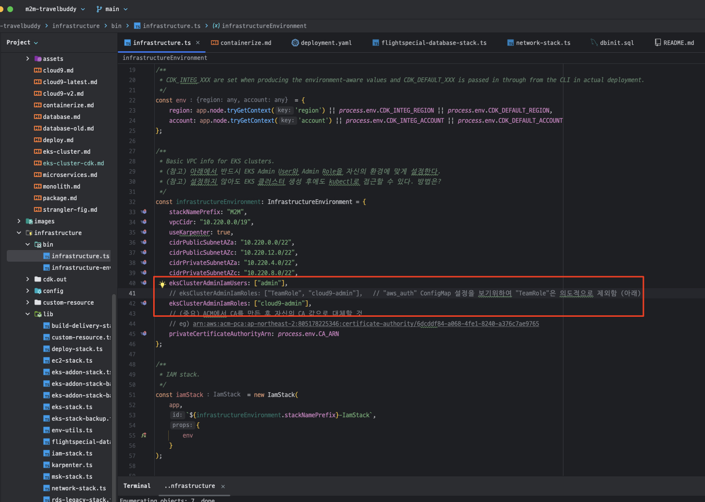
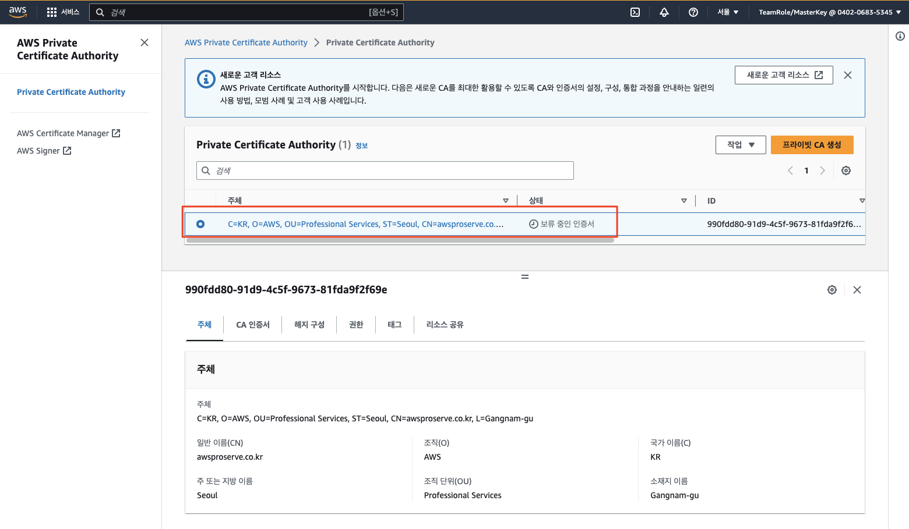
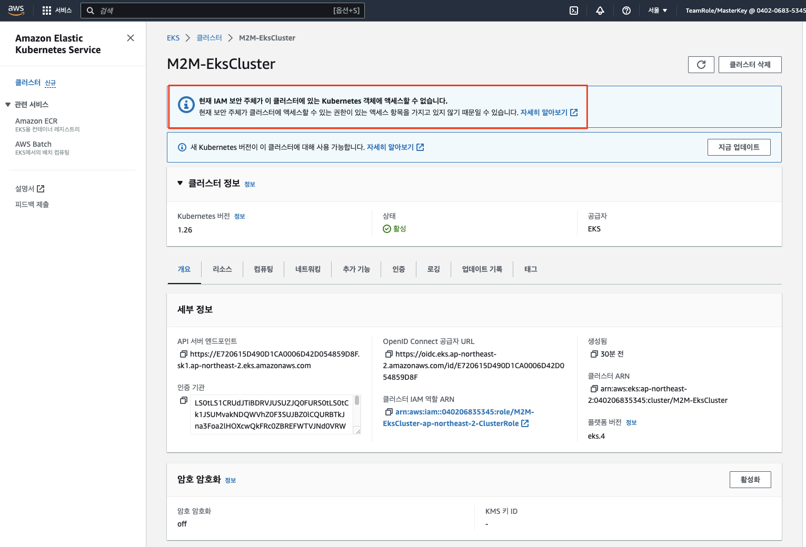
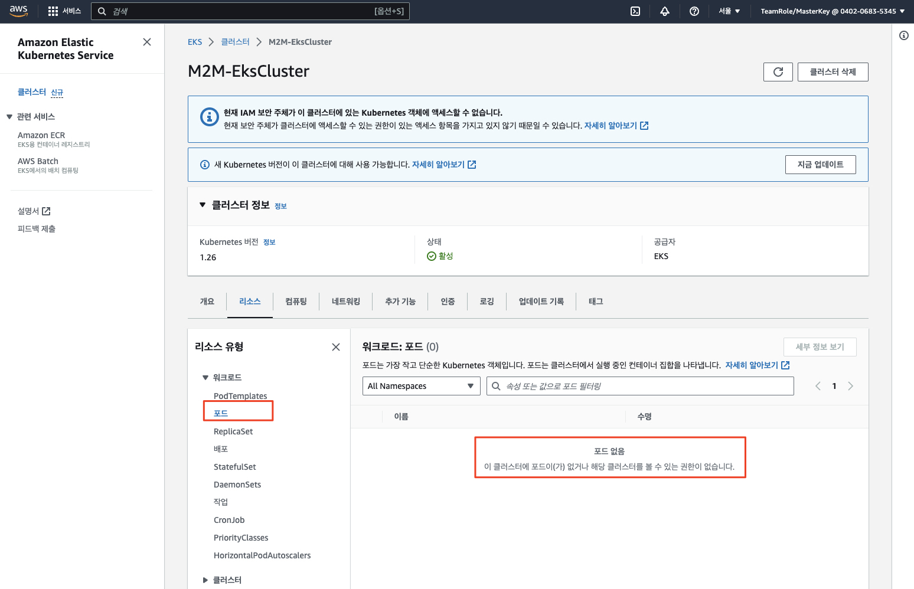

# EKS Cluster 생성

## Agenda

- AWS CDK를 사용하여 EKS 클러스터 생성하기
- (Optional) 콘솔 권한 추가하기
- 현재의 아키텍처 리뷰

## AWS CDK를 사용하여 EKS 클러스터 생성하기
우리는 이미 앞선 과정에서 테라폼 (Terraform)을 사용하여 Amazon EKS를 생성하는 과정을 배웠습니다.<br>
이번에는 AWS CDK를 사용하여 EKS를 생성해 봄으로서 각 IaC 도구가 가지는 특성을 직접 파악해 보고자 합니다.<br>
- AWS CDK의 장점 
  - Rollback 지원
  - State 파일 관리가 필요 없음
  - 개발자 친환적 - 인프라를 진정한 프로그래밍 코드로 구성
  - 필요한 Role과 Permission Policy를 자동으로 구성
- Terraform의 장점
  - 단순한 Declaritive 언어를 통해 로직을 신경쓰지 않고 인프라를 직관적으로 구성

아래 명령어를 통해, 클러스터를 배포합니다. 30 ~ 40분 정도 소요됩니다.<br>

- (참고) ```~/environment/m2m-travelbuddy/infrastructure/bin/infrastructure.ts``` 파일 40, 42라인 근방에서 EKS Admin User와 Admin Role을 자신이 생성한 User 혹은 Role (예: cloud9-admin)을 포함하고 있는지 확인합니다. 우리는 이 정보를 사용하여 ```aws_auth``` ConfigMap의 동작 양상을 한번 살펴볼 것입니다. (혹시 강사가 언급하는 것을 깜빡한다면 알려주세요~^^)
    

- (참고) 설정하지 않아도 EKS 클러스터 생성 후에 kubectl로 접근할 수 있습니다. 방법은?

아래 명령을 실행하여 Day 1 자원을 생성하기에 앞서 몇몇 ALB (ArgoCD, Argo Rollouts 등)에서 사용하기 위한 Amazon Certificate Manager (ACM) 사설 (Private) CA를 생성하고 Self-signed Root CA 인증서를 설치합니다.<br>

먼저 사설 CA를 설치합니다.<br>
```bash
hash -d aws

cd ~/environment/m2m-travelbuddy/prepare/acm

# 1. Create Private Certificate Authority.
export CA_ARN=`aws acm-pca create-certificate-authority --certificate-authority-configuration file://ca-config.txt --revocation-configuration file://ocsp-config.txt --certificate-authority-type "ROOT" --idempotency-token 01234567 --tags Key=Name,Value=AwsProservePCA | jq --raw-output .CertificateAuthorityArn`
echo $CA_ARN
```

위와 같이 수행하면 ACM에 사설 CA가 생성되는데 강사와 함께 ACM 콘솔로 이동하여 Private CA를 한번 살펴봅니다.<br>
아래와 같이 Private CA가 Pending 상태 (보류 중인 인증서)인 것을 알 수 있습니다.<br>



이 사설 CA에 Self-signed 인증서를 아래와 같이 발행하고 설치해 봅니다.<br>
```bash
# 2. Generate a certificate signing request (CSR).
aws acm-pca get-certificate-authority-csr \
     --certificate-authority-arn ${CA_ARN} \
     --output text > ca.csr

# 3. View and verify the contents of the CSR.
openssl req -text -noout -verify -in ca.csr

# 4. Root CA 인증서를 발행합니다.
export CERTIFICATE_ARN=`aws acm-pca issue-certificate --certificate-authority-arn ${CA_ARN} --csr fileb://ca.csr --signing-algorithm SHA256WITHRSA --template-arn arn:aws:acm-pca:::template/RootCACertificate/V1 --validity Value=3650,Type=DAYS | jq --raw-output .CertificateArn`
echo $CERTIFICATE_ARN

# 5. Root CA 인증서를 가져옵니다.
aws acm-pca get-certificate \
	--certificate-authority-arn ${CA_ARN} \
	--certificate-arn ${CERTIFICATE_ARN} \
	--output text > cert.pem
	
# 6. Certificate 정보를 OpenSSL로 조회해 봅니다.
openssl x509 -in cert.pem -text -noout

# 7. Root CA 인증서를 CA로 주입하고 설치합니다.
aws acm-pca import-certificate-authority-certificate \
     --certificate-authority-arn ${CA_ARN} \
     --certificate fileb://cert.pem     

# 8. 사설 CA의 상태를 살펴봅니다. ACTIVE 상태임을 확인합니다.
 aws acm-pca describe-certificate-authority \
	--certificate-authority-arn ${CA_ARN} \
	--output json
```

위 과정을 수행하면 사설 CA 상태가 활성화되고 자원을 생성할 준비가 되었습니다.<br>


이제 자원을 배포하기 위하여 다음과 같이 수행하면 됩니다.

```bash
# 1. IaC 디렉토리로 이동
cd ~/environment/m2m-travelbuddy/infrastructure

# 2. Upgrade CDK - (2023-07-17) 아래는 Cloud9 설정 과정에서 이미 수행하였으므로 더 이상 수행하지 않아도 됨
#npm uninstall -g aws-cdk
#rm -rf ~/.nvm/versions/node/v16.20.0/bin/cdk
#npm install -g aws-cdk
#cdk --version


# 3. npm install package dependencies
npm install

# 4. AWS CDK Bootstrap
cdk bootstrap


# 5. CDK synthesize & deploy for Day 1
#cdk synth && cdk deploy --all --outputs-file ./cdk-outputs.json --require-approval=never
npm run day1
```

배포가 진행되는 동안에 우리가 무엇을 배포하고 있는지 잠깐 살펴보도록 하겠습니다.<br>
아래 그림은 모더나이제이션의 가장 초기 단계에서 예상되는 블루프린트 아키텍처입니다.<br>
그림에 나타난 모든 구성 요소가 생성되지는 않지만 VPC, EKS 등의 핵심 자원과 파이프라인이 생성될 것입니다.<br>


배포가 성공적으로 완료되면 아래와 같이 표시됩니다.<br>


배포 이후에 안내되는 아래와 같은 "aws eks update-kubeconfig ~~~" 명령을 수행하여 EKS 클러스터에 접근하기 위한 설정을 해줍니다.
> M2M-EksStack.M2MEksClusterConfigCommand3B10CDA8 = aws eks update-kubeconfig --name M2M-EksCluster --region ap-northeast-2 --role-arn arn:aws:iam::663701857288:role/M2M-EksCluster-ap-northeast-2-MasterRole

```bash
# ~/.kube/config 파일 설정
# (중요) 자신의 배포 결과에서 표시된 명령을 사용할 것.
aws eks update-kubeconfig --name M2M-EksCluster --region ap-northeast-2 --role-arn arn:aws:iam::663701857288:role/M2M-EksCluster-ap-northeast-2-MasterRole

# 클러스터 배포 확인
kubectl get nodes
```

## (이슈 해결하기) AWS 콘솔에서 EKS 클러스터 자원 표시 가능하도록 설정
우리는 CDK를 통하여 EKS 클러스터를 성공적으로 배포하였습니다.<br>
이제 잠깐 AWS 콘솔을 통해서 생성된 클러스터를 둘러보도록 하겠습니다.

1. AWS EKS 콘솔에서 Pod 등의 쿠버네테스 자원을 조회할 수 있을까요? 조회가 불가능하다면 그 이유는 무엇일까요?
    <br>
    <br>
   1. (힌트) 쿠버네테스 자원 중 ```aws-auth``` ConfigMap에 비밀이 숨겨져 있습니다.
   2. (참조) https://docs.aws.amazon.com/eks/latest/userguide/add-user-role.html
2. 강사와 함께 Amazon EKS 클러스터를 대상으로 ```kubectl``` 명령이 수행될 때의 인증 과정을 살펴보십시요.
   1. ```~/.kube/config``` 파일을 참고하여 쿠버네테스의 인증 토큰 획득
   2. 획득한 인증 토큰을 사용하여 쿠버네테스의 API 서버 호출
   3. (참고 URL) https://www.notion.so/AWS-EKS-Kubectl-5659dc627ea044719b385030693c8011?pvs=4
3. Amazon EKS 인증 과정 참고 자료
   1. [kubectl과 AWS IAM Authenticator 인증](https://ssup2.github.io/theory_analysis/AWS_EKS_%EC%9D%B8%EC%A6%9D/)에 대하여


## TravelBuddy Blue Print 아키텍처
위에서 잠깐 언급되었지만, 현재 배포된 EKS 클러스터 및 추후 구성이 고려될 수 있는 요소를 포함한 TravelBuddy 어플리케이션의 Blue Print 아키텍처는 다음과 같습니다.


포함된 자원을 다이어그램으로 표시하면 위와 같으며, 이중에서 🔴로 표시된 자원이 이 패키지에 포함되어 있습니다.
1.	VPC 및 서브넷
      * 공통 네트워킹으로 정의될 경우 각 서비스 도메인에서 공용 네트워크 자원을 사용
2.	EKS Fargate 클러스터: 서비스별 자원
3.	Elasticache Redis 클러스터: 공통 자원
4.	어플리케이션 CodeCommit 리포지터리 
      * 어플리케이션 소스 코드가 저장
      * 소스 코드가 푸시되면 빌드 및 전달 파이프라인이 시작되며 (5), 컨테이너 이미지가 생성되면 ECR에 저장됩니다 (6).
5.	빌드 및 전달 CodePipeline
       * 4의 소스 코드가 Push되면 Pipeline이 동작하여 컨테이너 이미지를 생성한 후 ECR 리포지터리로 푸시
6.	Elastic Container Registry (ECR) 리포지터리
       * 5에서 생성된 컨테이너 이미지를 담는 컨테이너 레지스트리
7.	EKS 배포 매니페스트 파일용 CodeCommit 리포지터리
       * 6에 저장된 컨테이너 이미지를 EKS 클러스터로 배포하는데 필요한 Kubernetes 매니페스트 파일들을 담고 있습니다.
       * 여기에는 Deployment, Service, Service Account 및 IAM Role, ConfigMap을 설정하거나 생성하는 매니페스트 파일과 Deploy Spec 파일이 포함되어 있습니다.
8.	배포 CodePipeline
       * 6의 ECR 리포지터리에 컨테이너 이미지가 Push되면 이를 감지하여 2의 EKS 클러스터에 배포
       * 6으로부터 애플리케이션 컨테이너 이미지를 Pull 한 후, 7에서 정의된 EKS 매니페스터 파일을 적용하여 EKS 클러스터에 배포
       * (참고) Kubernetes 클러스터를 다룰 수 있도록 kubectl이 CodeBuild 실행 시 설치됩니다.
      
인프라스트럭처 레벨의 CDK가 배포되게 되면 위에서 설명된 자원이 생성됩니다. 이후 어플리케이션 소스 코드가 리포지터리에 Push되면 CI/CD 빌드 파이프라인이 동작하여 생성된 자원들 중 하나인 ECR에 컨테이너 이미지를 생성하게 됩니다. 이후 배포 파이프라인이 작동하여 ECR에서 컨테이너 이미지를 Pull 한 다음, 별도로 정의되는 Kubernetes 매니페스트 파일을 참조하여 해당 이미지를 최종적으로 EKS 클러스터로 배포하게 됩니다. 즉, 배포 파이프라인에서는 (ECR 컨테이너 리포지터리 + Kubernetes 매니페스트 파일 CodeCommit 리포지터리) 의 결합으로 소스를 정의하는 점을 참고하시면 좋습니다.


