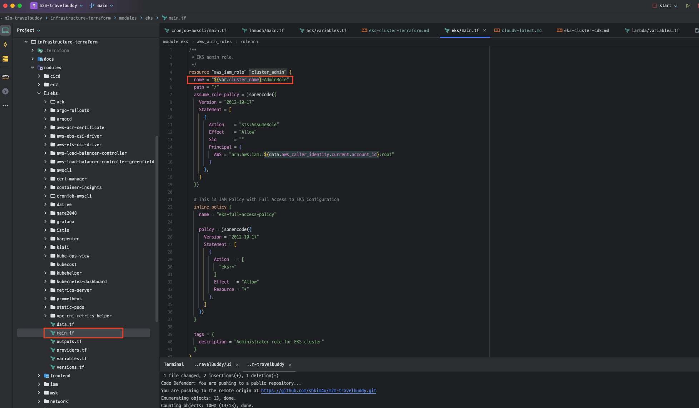
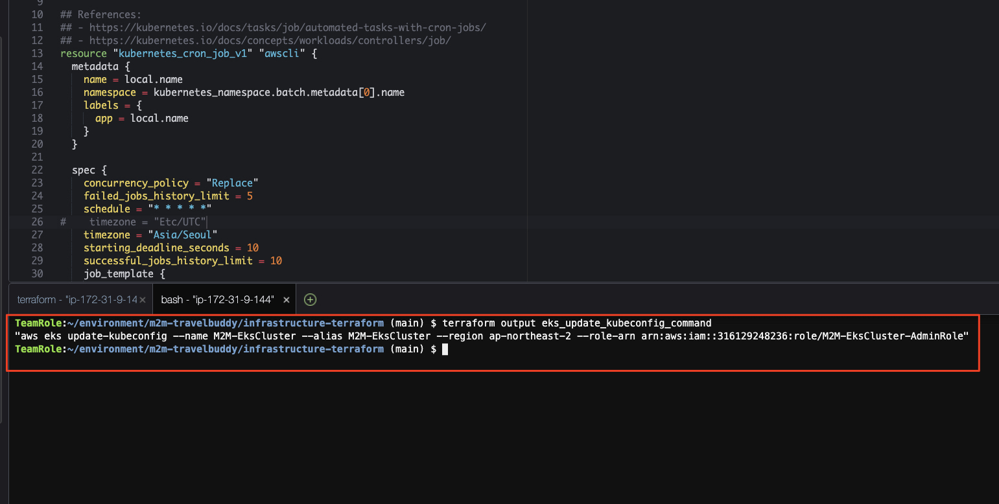
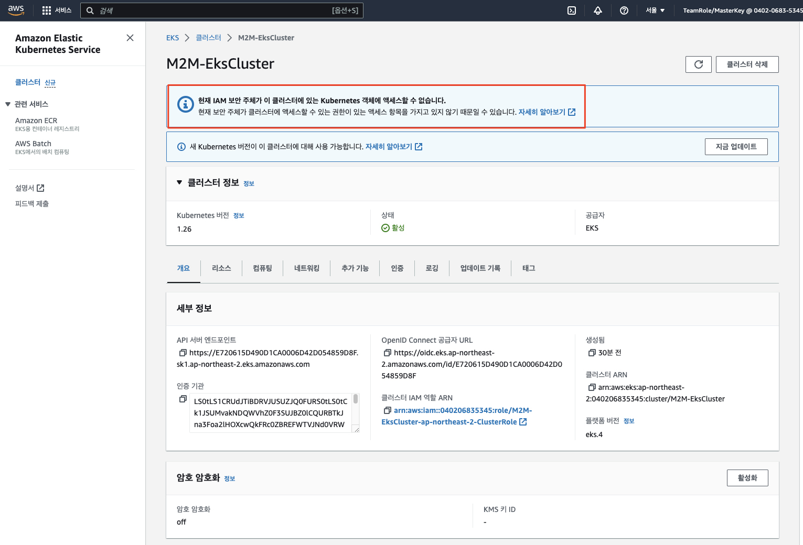
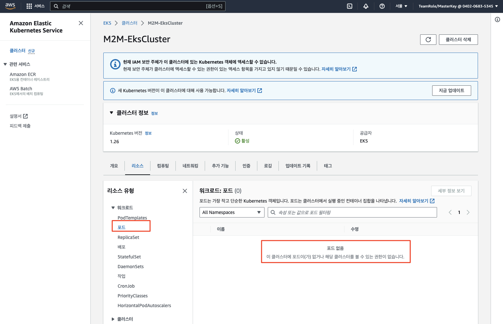

# EKS Cluster 생성 (테라폼 사용)

## Agenda

- 테라폼을 사용하여 EKS 클러스터 생성하기
- (Optional) 콘솔 권한 추가하기
- 현재의 아키텍처 리뷰

## 테라폼을 사용하여 EKS 클러스터 생성하기
우리는 이미 앞선 과정에서 CDK를 사용하여 Amazon EKS를 생성하는 과정을 배웠습니다.<br>
이번에는 이러한 내용을 포함하고 있는 테라폼 IaC 코드를 사용하여 EKS 클러스터를 배포하고 이후 과정으로 진행할 준비를 하고자 합니다.<br>
- 테라폼의 장점 
  - 자원 관리를 적절한 추상화 수준에서 정의하고 통제할 수 있는 설정 언어 지원 (HCL)
  - IaC 코드, 상태 파일, 실제 자원을 일치시키기 위하여 최선의 노력 (Best Effort)
  - 다양한 클라우드 및 플랫폼 지원 (Vendor & platform-agnostic) 
- AWS CDK의 장점
  - Rollback 지원
  - State 파일 관리가 필요 없음
  - 개발자 친환적 - 인프라를 진정한 프로그래밍 코드로 구성
  - 필요한 Role과 Permission Policy를 자동으로 구성

아래 명령어를 통해, 클러스터를 배포합니다. 30 ~ 40분 정도 소요됩니다.<br>

- (참고) ```~/environment/m2m-travelbuddy/infrastructure-terraform/modules/eks/main.tf``` 파일 5라인 근방에서 EKS Admin Role을 확인해 봅니다. 우리는 이 정보를 사용하여 ```aws_auth``` ConfigMap의 동작 양상을 한번 살펴볼 것입니다. (혹시 강사가 언급하는 것을 깜빡한다면 알려주세요~^^)
    

- (참고) 설정하지 않아도 EKS 클러스터 생성 후에 kubectl로 접근할 수 있습니다. 방법은?

아래 명령을 실행하여 Day 1 자원을 생성하기에 앞서 몇몇 ALB (ArgoCD, Argo Rollouts 등)에서 사용하기 위한 Amazon Certificate Manager (ACM) 사설 (Private) CA를 생성하고 Self-signed Root CA 인증서를 설치합니다.<br>

```bash
hash -d aws

cd ~/environment/m2m-travelbuddy/infrastructure-terraform

# 1. Configure Terraform workspace and Private Certificate Authority.
. ./configure.sh travelbuddy-prod

echo $TF_VAR_ca_arn
```

위와 같이 수행하면 ACM에 사설 CA가 생성되는데 강사와 함께 ACM 콘솔로 이동하여 Private CA를 한번 살펴봅니다.<br>
아래와 같이 Private CA가 활성 상태인 것을 확인합니다.<br>


이제 자원을 배포하기 위하여 다음과 같이 수행하면 됩니다.<br>
* 어플리케이션 컴퓨팅 환경
    * 아래에서 배포될 레거시 데이터베이스와는 달리 어플리케이션 컴퓨팅 환경은 쿠버네테스를 대상으로 하여 컨테이너화가 완료되었고, 자원들은 테라폼으로 배포되고 있습니다.
    * 여기에는 향후 마이크로서비스로 분리될 것을 대비한 특정 마이크로서비스 전용 Pologlot 데이터베이스 자원 (PostgreSQL)도 포함되어 있습니다.<br>
    * (참고) Amazon MSK 클러스터는 생성하는데 시간이 다소 소요되므로 (약 30분) 오늘 과정에서는 생성하지 않고 내일 생성하도록 합니다.<br>
      ```bash
      # 1. IaC 디렉토리로 이동
      cd ~/environment/m2m-travelbuddy/infrastructure-terraform
      
      # terraform init
      terraform init
      
      # terraform plan
      terraform plan
      
      # terraform apply
      terraform apply -var='exclude_msk=true' -auto-approve
      ```
* 레거시 모놀리스 데이터베이스
  * 운영팀에서는 레거시 모놀리스 어플리케이션에 사용되는 데이터베이스를 AWS의 CloudFormation으로 생성하였다고 합니다. 이 CloudFormation 템플릿 파일을 사용하여 데이터베이스를 생성하는 과정은 이후에 진행될 데이터베이스 설정 항목에서 살펴봅니다.<br>

배포가 진행되는 동안에 우리가 무엇을 배포하고 있는지 잠깐 살펴보도록 하겠습니다.<br>
아래 그림은 모더나이제이션의 가장 초기 단계에서 예상되는 블루프린트 아키텍처입니다.<br>
그림에 나타난 모든 구성 요소가 생성되지는 않지만 VPC, EKS 등의 핵심 자원과 파이프라인이 생성될 것입니다.<br>


배포가 성공적으로 완료되면 아래와 같이 표시됩니다.<br>


또한 배포되는 EKS 클러스터에 대해 ```kubectl```을 수행할 수 있도록 "aws eks update-kubeconfig ~~~" 명령이 자동으로 수행되어 EKS 클러스터에 접근하기 위한 설정을 해줍니다.<br>
이 사항은 다음 명령을 통해 확인할 수 있습니다.<br>
```bash
terraform output eks_update_kubeconfig_command
```



## (이슈 해결하기) AWS 콘솔에서 EKS 클러스터 자원 표시 가능하도록 설정
우리는 테라폼을 통하여 EKS 클러스터를 성공적으로 배포하였습니다.<br>
이제 잠깐 AWS 콘솔을 통해서 생성된 클러스터를 둘러보도록 하겠습니다.

1. AWS EKS 콘솔에서 Pod 등의 쿠버네테스 자원을 조회할 수 있을까요? 조회가 불가능하다면 그 이유는 무엇일까요?
    <br>
    <br>
   1. (힌트) 쿠버네테스 자원 중 ```aws-auth``` ConfigMap에 비밀이 숨겨져 있습니다.
   2. (참조) https://docs.aws.amazon.com/eks/latest/userguide/add-user-role.html
2. 강사와 함께 Amazon EKS 클러스터를 대상으로 ```kubectl``` 명령이 수행될 때의 인증 과정을 살펴보십시요.
   1. ```~/.kube/config``` 파일을 참고하여 쿠버네테스의 인증 토큰 획득
   2. 획득한 인증 토큰을 사용하여 쿠버네테스의 API 서버 호출
   3. (Reference) [Amazon EKS IAM Authenticator](./amazon-eks-cluster-authentication.md)
3. Amazon EKS 인증 과정 참고 자료
   1. [[Kubernetes Authentication Strategies]](https://kubernetes.io/docs/reference/access-authn-authz/authentication/)
   2. [[Amazon EKS Cluster 인증]](https://docs.aws.amazon.com/eks/latest/userguide/cluster-auth.html)
   3. [[(타사) AKS(Azure Kubernetes Service)의 액세스 및 ID 옵션]](https://learn.microsoft.com/ko-kr/azure/aks/concepts-identity)

## TravelBuddy 블루프린트 아키텍처
위에서 잠깐 언급되었지만, 현재 배포된 EKS 클러스터 및 추후 구성이 고려될 수 있는 요소를 포함한 TravelBuddy 어플리케이션의 Blue Print 아키텍처는 다음과 같습니다.


포함된 자원을 다이어그램으로 표시하면 위와 같으며, 이중에서 🔴로 표시된 자원이 이 패키지에 포함되어 있습니다.
1.	VPC 및 서브넷
      * 공통 네트워킹으로 정의될 경우 각 서비스 도메인에서 공용 네트워크 자원을 사용
2.	EKS Fargate 클러스터: 서비스별 자원
3.	Elasticache Redis 클러스터: 공통 자원
4.	어플리케이션 CodeCommit 리포지터리 
      * 어플리케이션 소스 코드가 저장
      * 소스 코드가 푸시되면 빌드 및 전달 파이프라인이 시작되며 (5), 컨테이너 이미지가 생성되면 ECR에 저장됩니다 (6).
5.	빌드 및 전달 CodePipeline
       * 4의 소스 코드가 Push되면 Pipeline이 동작하여 컨테이너 이미지를 생성한 후 ECR 리포지터리로 푸시
6.	Elastic Container Registry (ECR) 리포지터리
       * 5에서 생성된 컨테이너 이미지를 담는 컨테이너 레지스트리
7.	EKS 배포 매니페스트 파일용 CodeCommit 리포지터리
       * 6에 저장된 컨테이너 이미지를 EKS 클러스터로 배포하는데 필요한 Kubernetes 매니페스트 파일들을 담고 있습니다.
       * 여기에는 Deployment, Service, Service Account 및 IAM Role, ConfigMap을 설정하거나 생성하는 매니페스트 파일과 Deploy Spec 파일이 포함되어 있습니다.
8.	배포 CodePipeline
       * 6의 ECR 리포지터리에 컨테이너 이미지가 Push되면 이를 감지하여 2의 EKS 클러스터에 배포
       * 6으로부터 애플리케이션 컨테이너 이미지를 Pull 한 후, 7에서 정의된 EKS 매니페스터 파일을 적용하여 EKS 클러스터에 배포
       * (참고) Kubernetes 클러스터를 다룰 수 있도록 kubectl이 CodeBuild 실행 시 설치됩니다.
      
인프라스트럭처 레벨의 테라폼 코드가 배포되게 되면 위에서 설명된 자원이 생성됩니다. 이후 어플리케이션 소스 코드가 리포지터리에 Push되면 CI/CD 빌드 파이프라인이 동작하여 생성된 자원들 중 하나인 ECR에 컨테이너 이미지를 생성하게 됩니다. 이후 배포 파이프라인이 작동하여 ECR에서 컨테이너 이미지를 Pull 한 다음, 별도로 정의되는 Kubernetes 매니페스트 파일을 참조하여 해당 이미지를 최종적으로 EKS 클러스터로 배포하게 됩니다. 즉, 배포 파이프라인에서는 (ECR 컨테이너 리포지터리 + Kubernetes 매니페스트 파일 CodeCommit 리포지터리) 의 결합으로 소스를 정의하는 점을 참고하시면 좋습니다.


